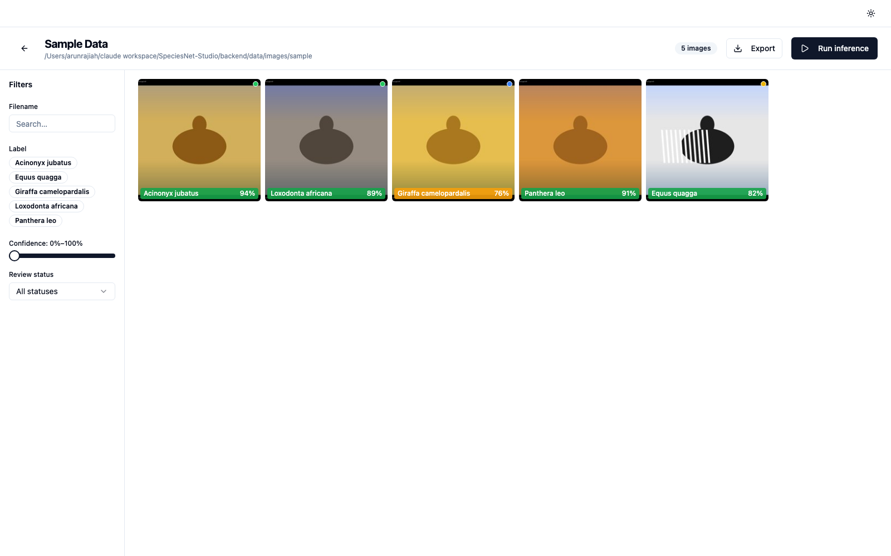
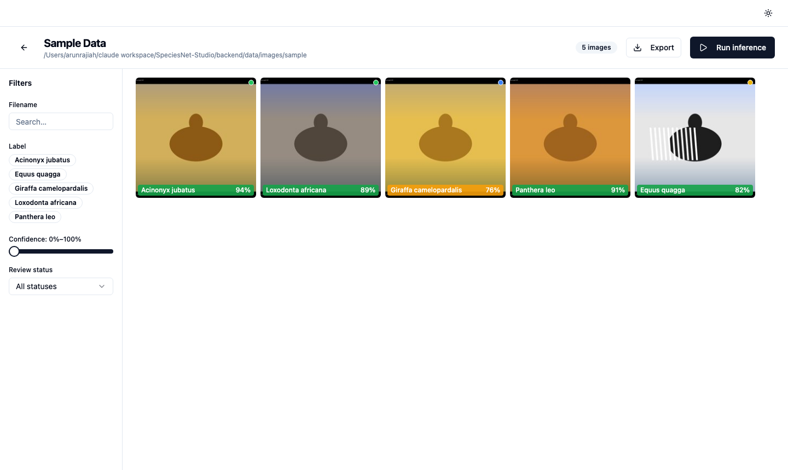
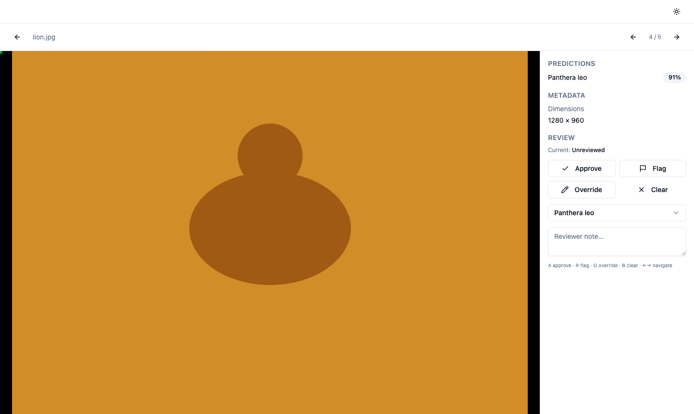
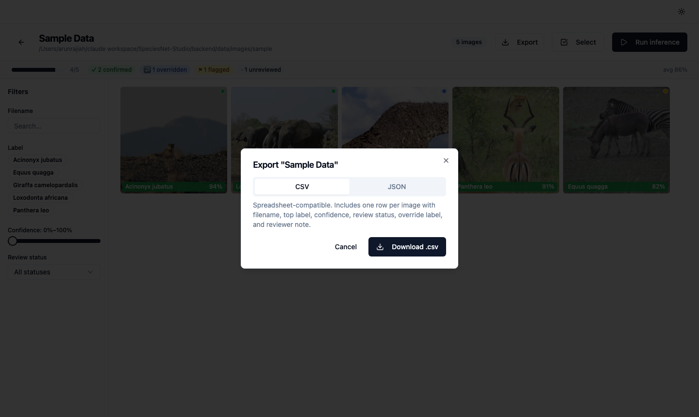

<div align="center">

# SpeciesNet Studio

**A self-hosted review UI for your SpeciesNet camera data.**

[](https://github.com/arunrajiah/speciesnet-studio/actions/workflows/ci.yml)
[](LICENSE)
[](https://github.com/arunrajiah/speciesnet-studio/releases)
[](https://github.com/arunrajiah/speciesnet-studio/pkgs/container/speciesnet-studio-backend)
[](https://github.com/sponsors/arunrajiah)

</div>



---

## Why this exists

Camera trap programs routinely produce millions of images per season. Google's SpeciesNet is an excellent open-source classifier — but its output is a JSON blob, and getting a human reviewer through that blob efficiently requires tooling that doesn't exist yet. Researchers need a human-in-the-loop review UI that runs on their own hardware, keeps their data on-premise, and doesn't require a cloud account. SpeciesNet Studio fills that gap.

---

## Features

### Ingest
- Point Studio at any local folder; it walks subdirectories and imports every JPG, PNG, and TIF
- EXIF datetime and GPS coordinates extracted automatically
- 300 px thumbnails generated for fast gallery rendering

### Infer
- Native SpeciesNet adapter using the Python API (`pip install speciesnet`)
- Pluggable adapter protocol — swap in MegaDetector, a custom model, or any CLI tool
- Live WebSocket progress bar while inference runs in the background

### Review
- Virtualized thumbnail gallery — smooth at 10 000+ images
- Confidence badges colour-coded green / amber / red
- Bounding box canvas overlay on full-res detail view
- Keyboard-driven review: **A** approve · **O** override · **R** flag · **B** clear · **← →** navigate
- Sidebar filters: species, confidence range, review status, filename search
- Filter state synced to URL (bookmarkable, shareable)

### Export
- Download results as **CSV** or **JSON** per collection
- Partner export format stubs (Wildlife Insights, iNaturalist) — PRs welcome

---

## Quickstart

```bash
git clone https://github.com/arunrajiah/speciesnet-studio
cd speciesnet-studio
docker compose up
```

Open [http://localhost:5173](http://localhost:5173) and click **"Try with sample data"** — no images required to get started.

---

## Using with your own data

**1. Put your images somewhere accessible**

```
/your/images/season-2024/
  ├── cam01/
  │   ├── IMG_0001.JPG
  │   └── ...
  └── cam02/
      └── ...
```

**2. Point Studio at that folder**

When creating a collection, enter the absolute path to your image root. Studio walks subdirectories automatically.

**3. Configure the inference adapter**

Edit `config/inference.yaml`:

```yaml
# Option A — native Python adapter (requires: pip install speciesnet)
adapter: speciesnet
speciesnet_country: KEN   # ISO-3166 code for geofencing, optional

# Option B — subprocess (any CLI tool that writes SpeciesNet-compatible JSON)
# adapter: subprocess
# adapter_command:
#   - python -m speciesnet.scripts.run_model
#   - --folders {folder}
#   - --predictions_json {output_json}
```

**4. Swap in a different model**

Implement the `InferenceAdapter` protocol (see [`backend/src/app/adapters/base.py`](backend/src/app/adapters/base.py)) and point the config at your adapter class. See [CONTRIBUTING.md](CONTRIBUTING.md) for details.

---

## Screenshots

| Gallery | Review detail | Export |
|---------|--------------|--------|
|  |  |  |

---

## Data privacy

Nothing leaves your machine. Your images and predictions stay on your disk. Studio makes no network calls during normal operation — the only exception is that SpeciesNet downloads its model weights from Kaggle/HuggingFace on first run (this is SpeciesNet's own behaviour, not Studio's).

---

## Contributing

See [CONTRIBUTING.md](CONTRIBUTING.md). Issues labelled [`good first issue`](https://github.com/arunrajiah/speciesnet-studio/labels/good%20first%20issue) are the best starting point. We especially welcome new model adapters and export formats.

---

## Sponsors

SpeciesNet Studio is built and maintained by [Arun Rajiah](https://github.com/arunrajiah) in his own time. If your lab, program, or foundation benefits from the tool, please consider sponsoring continued development.

**[Become a sponsor →](https://github.com/sponsors/arunrajiah)**  
See [`.github/SPONSOR_TIERS.md`](.github/SPONSOR_TIERS.md) for tier details and what your support funds.  
See [docs/supporters.md](docs/supporters.md) for current supporters.

---

## Acknowledgments

SpeciesNet Studio builds directly on the work of:

- **[Google SpeciesNet / CameraTrapAI](https://github.com/google/cameratrapai)** — the classifier at the heart of this tool; Apache 2.0.
- **[Microsoft AI for Good / MegaDetector](https://github.com/microsoft/CameraTraps)** — detection pipeline whose design patterns informed the adapter framework; MIT.
- **[LILA BC](https://lila.science)** — Creative Commons camera trap datasets used in the sample-data onboarding flow.
- **[Wildlife Insights](https://wildlifeinsights.org)** — export schema reference; inspiration for the review workflow.
- The broader camera-trap research community whose published workflows shaped every design decision here.

---

## License

[Apache 2.0](LICENSE) — see [NOTICE](NOTICE) for third-party attributions.
